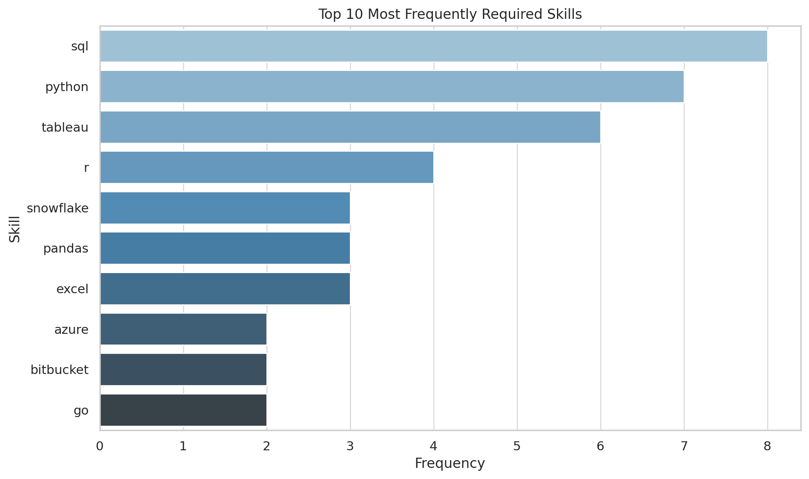

# **Introduction**

This repository documents my hands-on learning experience with [Luke Barousse's SQL for Data Analytics course](https://www.lukebarousse.com/sql). This project identifies the top-paying jobs, in-demand skills, and the intersection of high demand with high salary in the field of data analytics.

Check out my SQL queries here: [project_sql folder](/project_sql/). 

# **Background**

This project was completed as part of the [Luke Barousse's SQL for Data Analytics course](https://www.lukebarousse.com/sql) and is designed to demonstrate my working knowledge of core SQL skills. The project is designed to understand the data analyst job market better. This project aimed to discover which skills are paid the most and in demand, making job searches more targeted and effective. 

The data for this analysis is from [Luke Barousse’s SQL Course](https://www.lukebarousse.com/sql). This data includes details on job titles, salaries, locations, and required skills. 

The questions I wanted to answer through my SQL queries were:

1. What are the top-paying data analyst jobs?
2. What skills are required for these top-paying jobs?
3. What skills are most in demand for data analysts?
4. Which skills are associated with higher salaries?
5. What are the most optimal skills to learn for a data analyst looking to maximize job market value?

# **Tools I Used**

In this project, I utilized a variety of tools to conduct my analysis:

- **SQL** (Structured Query Language): Enabled me to interact with the database, extract insights, and answer my key questions through queries.
- **PostgreSQL**: As the database management system, PostgreSQL allowed me to store, query, and manipulate the job posting data.
- **Visual Studio Code:** This open-source administration and development platform helped me manage the database and execute SQL queries.

# **The Analysis**

Each query for this project aimed at investigating specific aspects of the data analyst job market. Here’s how I approached each question:

### 1. Top Paying Data Analyst Jobs

To identify the highest-paying roles, I filtered data analyst positions by average yearly salary and location, focusing on remote jobs. This query highlights the high paying opportunities in the field.

```sql
SELECT
	job_id,
	job_title,
	job_location,
	job_schedule_type,
	salary_year_avg,
	job_posted_date,
    name as company_name
FROM
	job_postings_fact
LEFT JOIN company_dim ON job_postings_fact.company_id = company_dim.company_id
WHERE
    job_title_short = 'Data Analyst' AND
    job_location = 'Anywhere' AND -- Available Remotely
    salary_year_avg IS NOT NULL
ORDER BY
    salary_year_avg DESC
LIMIT 10
```

Here's the breakdown of the top data analyst jobs in 2023:
- **Wide Salary Range:** Top 10 paying data analyst roles span from $184,000 to $650,000, indicating significant salary potential in the field.
- **Diverse Employers:** Companies like SmartAsset, Meta, and AT&T are among those offering high salaries, showing a broad interest across different industries.
- **Job Title Variety:** There's a high diversity in job titles, from Data Analyst to Director of Analytics, reflecting varied roles and specializations within data analytics.

### 2. Skills for Top Paying Jobs

To understand what skills are required for the top-paying jobs, I joined the job postings with the skills data, providing insights into what employers value for high-compensation roles.

```sql
WITH top_paying_jobs AS (
    SELECT
        job_id,
        job_title,
        salary_year_avg,
        name as company_name
    FROM
        job_postings_fact
    LEFT JOIN company_dim ON job_postings_fact.company_id = company_dim.company_id
    WHERE
        job_title_short = 'Data Analyst' AND
        job_location = 'Anywhere' AND -- Available Remotely
        salary_year_avg IS NOT NULL
    ORDER BY
        salary_year_avg DESC
    LIMIT 10
)

SELECT 
    top_paying_jobs.*,
    skills
from top_paying_jobs
INNER JOIN 
    skills_job_dim ON top_paying_jobs.job_id = skills_job_dim.job_id
INNER JOIN 
    skills_dim on skills_job_dim.skill_id = skills_dim.skill_id
ORDER BY
    salary_year_avg DESC
```
#### Observations:

- **High-Paying Skills:** Niche or advanced tools like Databricks, PySpark, and Jupyter are associated with the highest salaries. Cloud skills (Azure, AWS) and big data tools (Hadoop, PySpark) are prominent in high-paying roles as well.

- **Commonly Requested:** SQL, Python, and Tableau are the most commonly requested skills.


*Bar graph visualizing the count of skills for the top 10 paying jobs for data analysts; ChatGPT generated this graph from my SQL query results.*


### 3. In-Demand Skills for Data Analysts

This query helped identify the skills most frequently requested in job postings, directing focus to areas with high demand.

```sql
SELECT
    skills,
    COUNT(skills_job_dim.job_id) AS demand_count
FROM 
    job_postings_fact
INNER JOIN 
    skills_job_dim ON job_postings_fact.job_id = skills_job_dim.job_id
INNER JOIN 
    skills_dim on skills_job_dim.skill_id = skills_dim.skill_id
WHERE
    job_title_short = 'Data Analyst' AND
    job_work_from_home = TRUE
GROUP BY
    skills
ORDER BY
    demand_count DESC
LIMIT 5
```

| Skill   | Demand Count |
|---------|--------------|
| sql     | 7291         |
| excel   | 4611         |
| python  | 4330         |
| tableau | 3745         |
| power bi| 2609         |

*Table of the demand for the top 5 skills in data analyst job postings*

### 4. Skills Based on Salary

Exploring the average salaries associated with different skills revealed which skills are the highest paying.

```sql
SELECT
    skills,
    ROUND(AVG(salary_year_avg), 0) AS avg_salary -- Round to nearest dollar
FROM 
    job_postings_fact
INNER JOIN 
    skills_job_dim ON job_postings_fact.job_id = skills_job_dim.job_id
INNER JOIN 
    skills_dim on skills_job_dim.skill_id = skills_dim.skill_id
WHERE
    job_title_short = 'Data Analyst' AND
    salary_year_avg IS NOT NULL
GROUP BY
    skills
ORDER BY
    avg_salary DESC
LIMIT 25
```
#### Observations:

- **High-paying roles blend data with DevOps or engineering:**
    Favoring skills like Terraform, Puppet, and Kafka that support automation, infrastructure, or scalable data systems.

- **AI/ML expertise commands premium salaries:**
    With tools like DataRobot, PyTorch, and Hugging Face topping the list—showing demand for analysts who can work with 
    predictive models.

- **Niche or cross-functional tools boost earning power:**
    Including legacy systems (SVN, Perl), communication platforms (Twilio), and workflow tools (Airflow, Notion), 
    signaling value in hybrid roles.

| Skill         | Avg Salary ($) |
|---------------|----------------|
| svn           | 400,000        |
| solidity      | 179,000        |
| couchbase     | 160,515        |
| datarobot     | 155,486        |
| golang        | 155,000        |
| mxnet         | 149,000        |
| dplyr         | 147,633        |
| vmware        | 147,500        |
| terraform     | 146,734        |
| twilio        | 138,500        |
| gitlab        | 134,126        |
| kafka         | 129,999        |
| puppet        | 129,820        |
| keras         | 127,013        |
| pytorch       | 125,226        |
| perl          | 124,686        |
| ansible       | 124,370        |
| hugging face  | 123,950        |
| tensorflow    | 120,647        |
| cassandra     | 118,407        |
| notion        | 118,092        |
| atlassian     | 117,966        |
| bitbucket     | 116,712        |
| airflow       | 116,387        |
| scala         | 115,480        |

*Table of the average salary for the top 25 paying skills for data analysts*

### 5. Most Optimal Skills to Learn
Combining insights from demand and salary data, this query aimed to pinpoint skills that are both in high demand and have high salaries, offering a strategic focus for skill development.

```sql
 SELECT
    skills_dim.skill_id,
    skills_dim.skills,
    COUNT(skills_job_dim.job_id) AS demand_count,
    ROUND(AVG(salary_year_avg), 0) AS avg_salary
FROM
    job_postings_fact
    INNER JOIN 
        skills_job_dim ON job_postings_fact.job_id = skills_job_dim.job_id
    INNER JOIN 
        skills_dim on skills_job_dim.skill_id = skills_dim.skill_id
    WHERE
        job_title_short = 'Data Analyst' AND
        salary_year_avg IS NOT NULL AND
        job_work_from_home = TRUE
GROUP BY
    skills_dim.skill_id
HAVING
    COUNT(skills_job_dim.job_id) > 10
ORDER BY
    avg_salary DESC,
    demand_count DESC
LIMIT 25
```
| Skill ID | Skill       | Demand Count | Avg Salary ($) |
|----------|-------------|---------------|----------------|
| 8        | go          | 27            | 115,320        |
| 234      | confluence  | 11            | 114,210        |
| 97       | hadoop      | 22            | 113,193        |
| 80       | snowflake   | 37            | 112,948        |
| 74       | azure       | 34            | 111,225        |
| 77       | bigquery    | 13            | 109,654        |
| 76       | aws         | 32            | 108,317        |
| 4        | java        | 17            | 106,906        |
| 194      | ssis        | 12            | 106,683        |
| 233      | jira        | 20            | 104,918        |
| 79       | oracle      | 37            | 104,534        |
| 185      | looker      | 49            | 103,795        |
| 2        | nosql       | 13            | 101,414        |
| 1        | python      | 236           | 101,397        |
| 5        | r           | 148           | 100,499        |
| 78       | redshift    | 16            | 99,936         |
| 187      | qlik        | 13            | 99,631         |
| 182      | tableau     | 230           | 99,288         |
| 197      | ssrs        | 14            | 99,171         |
| 92       | spark       | 13            | 99,077         |
| 13       | c++         | 11            | 98,958         |
| 186      | sas         | 63            | 98,902         |
| 7        | sas         | 63            | 98,902         |
| 61       | sql server  | 35            | 97,786         |
| 9        | javascript  | 20            | 97,587         |

*Table of the most optimal skills for Data Analysts in 2023*

Each query not only served to answer a specific question but also to improve my understanding of SQL and database analysis. Through this project, I learned to leverage SQL's powerful data manipulation capabilities to derive meaningful insights from complex datasets.

# **What I Learned**

Throughout this project, I honed several key SQL techniques and skills:

- **Complex Query Construction**: Learning to build advanced SQL queries that combine multiple tables and employ functions like **`WITH`** clauses for common table expressions(CTE).
- **Data Aggregation**: Utilizing **`GROUP BY`** and aggregate functions like **`COUNT()`** and **`AVG()`** to summarize data effectively.
- **Analytical Thinking**: Developing the ability to translate real-world questions into actionable SQL queries that got insightful answers.


# **Conclusion**


### **Insights**

From the analysis, several general insights emerged:

1. **Top-Paying Data Analyst Jobs**: The highest-paying jobs for data analysts that allow remote work offer a wide range of salaries, the highest at $650,000!
2. **Skills for Top-Paying Jobs**: High-paying data analyst jobs require advanced proficiency in SQL, suggesting it’s a critical skill for earning a top salary.
3. **Most In-Demand Skills**: SQL is also the most demanded skill in the data analyst job market, thus making it essential for job seekers.
4. **Skills with Higher Salaries**: Specialized skills, such as SVN and Solidity, are associated with the highest average salaries, indicating a premium on niche expertise.
5. **Optimal Skills for Job Market Value**: SQL leads in demand and offers for a high average salary, positioning it as one of the most optimal skills for data analysts to learn to maximize their market value.

### **Summary**
This project enhanced my SQL skills and provided valuable insights into the data analyst job market. The findings from the analysis serve as a guide to prioritizing skill development and job search efforts. Aspiring data analysts can better position themselves in a competitive job market by focusing on high-demand, high-salary skills. This exploration highlights the importance of continuous learning and adaptation to emerging trends in the field of data analytics.